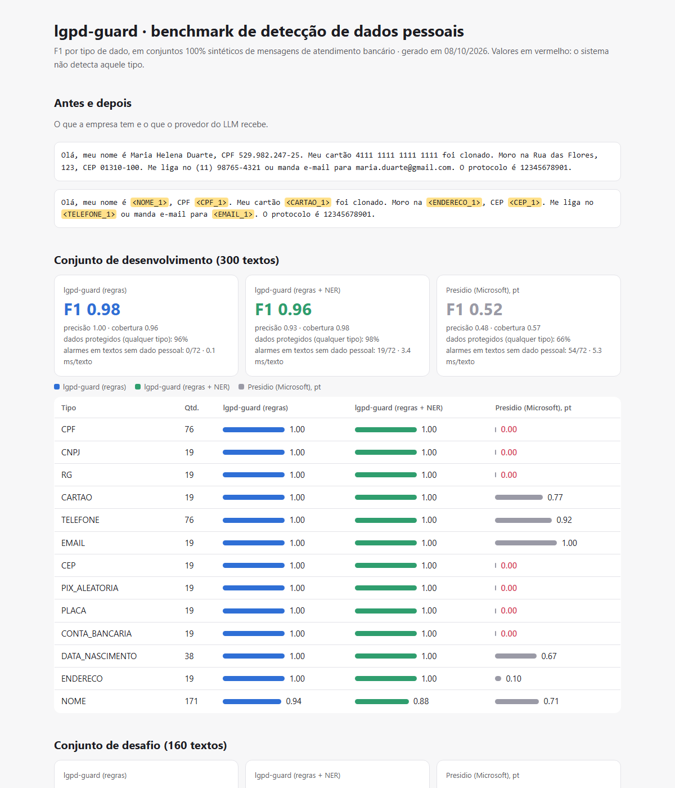
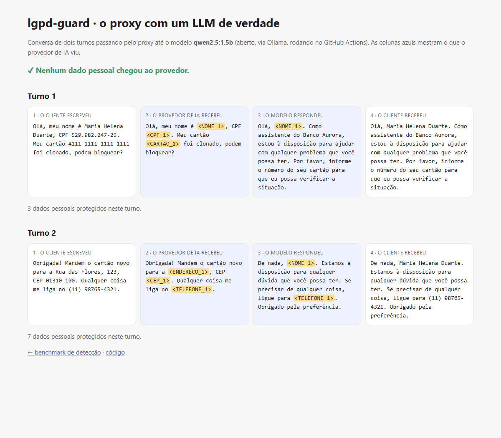

# lgpd-guard

[](https://github.com/arthurpenedo/lgpd-guard/actions/workflows/ci.yml)
[](https://github.com/arthurpenedo/lgpd-guard/actions/workflows/benchmark.yml)


> **Firewall de dados pessoais para LLMs.** Detecta CPF, CNPJ, cartão, RG, telefone, nomes e outros
> 7 tipos de dado pessoal brasileiro, troca cada um por um marcador antes de o texto ir para o
> provedor de IA e desfaz a troca na resposta. O provedor nunca vê o dado real.

**Benchmark ao vivo:** [arthurpenedo.github.io/lgpd-guard](https://arthurpenedo.github.io/lgpd-guard/) · **Proxy com um LLM de verdade:** [demo ↗](https://arthurpenedo.github.io/lgpd-guard/demo.html)



```text
Empresa:  Olá, meu nome é Maria Helena Duarte, CPF 529.982.247-25. Meu cartão 4111 1111 1111 1111 foi clonado.
Provedor: Olá, meu nome é <NOME_1>, CPF <CPF_1>. Meu cartão <CARTAO_1> foi clonado.
Resposta: Sinto muito, <NOME_1>. Bloqueei o cartão <CARTAO_1>.
Cliente:  Sinto muito, Maria Helena Duarte. Bloqueei o cartão 4111 1111 1111 1111.
```

## O problema

Todo banco quer usar LLMs no atendimento, e toda conversa de atendimento tem CPF, cartão, endereço
e nome. Pela LGPD, mandar isso a um provedor externo de IA exige base legal, contrato e cuidado com
transferência internacional. O caminho mais seguro é o dado **não sair**.

A ferramenta de referência para isso é o [Presidio](https://github.com/microsoft/presidio), da Microsoft.
Ele tem reconhecedores para EUA, Reino Unido, Espanha, Índia, Coreia e outros países, mas **nenhum
brasileiro**: não reconhece CPF, CNPJ, RG, CEP nem chave Pix.

## Resultados

Dois conjuntos sintéticos de mensagens de atendimento bancário, com cada dado pessoal rotulado:

- **Desenvolvimento** (300 textos): as regras foram ajustadas olhando os erros dele, então o número é otimista.
- **Desafio** (160 textos): escrito **depois**, com frases e formatos novos (WhatsApp, CPF com espaços, DDD com 0,
  nome no início da mensagem), e **nunca usado para ajustar as regras**. É o número que vale.

| Conjunto de **desafio** | lgpd-guard (regras) | lgpd-guard (regras + NER) | Presidio, configurado em português |
|---|---:|---:|---:|
| **F1** | 0,81 | **0,94** | 0,60 |
| Precisão | **1,00** | 0,94 | 0,58 |
| **Dados protegidos** (qualquer tipo) | 67,9% | **94,4%** | 66,5% |
| Textos sem dado pessoal marcados por engano | **0 de 26** | **0 de 26** | 22 de 26 |
| Tempo por texto (CPU do runner) | **0,1 ms** | 3 ms | 4 ms |

| F1 por tipo (desafio) | regras | regras + NER | Presidio |
|---|---:|---:|---:|
| CPF, CNPJ, CEP, chave Pix | 1,00 | 1,00 | **0,00** |
| Cartão | 1,00 | 1,00 | 0,96 |
| Telefone | 1,00 | 1,00 | 0,78 |
| E-mail | 1,00 | 1,00 | 1,00 |
| Data de nascimento | 1,00 | 1,00 | 0,50 |
| Endereço | 0,96 | 0,96 | 0,31 |
| Nome | 0,00 | 0,83 | 0,72 |

No conjunto de desenvolvimento: F1 de 0,98 (regras), 0,96 (regras + NER) e 0,52 (Presidio).

### O que os números mostram

1. **Validação matemática dá precisão de 100%.** CPF, CNPJ e cartão só são aceitos se os dígitos
   verificadores (ou o algoritmo de Luhn) conferem. Um protocolo de 11 dígitos não vira CPF, e um valor em
   reais ou uma data de vencimento não viram nada.
2. **Regras sozinhas não acham nomes em frases novas** (F1 0,00 no desafio), e é por isso que existe a camada
   de NER. Com ela, a proteção sobe de 68% para 94%.
3. **O Presidio protege 66,5%**, porque deixa passar todos os documentos brasileiros, e marca como dado
   pessoal 22 dos 26 textos que não tinham nenhum (datas de vencimento, nomes de bancos, palavras no início
   da frase).
4. **O gargalo agora é o NER pequeno do spaCy:** nomes em minúsculas (transcrição de ligação: "olivia porto")
   e verbos no início da frase lidos como nomes ("Mandei o Pix"). Por isso o próximo passo é treinar um NER
   próprio (veja o roteiro).

## Como funciona

```
texto ──► reconhecedores por regra ─────┐
          (padrão + validador + contexto) │
                                          ├──► resolve sobreposições ──► entidades ──► pseudonimizador ──► <CPF_1>
texto ──► NER em português (spaCy) ──────┘     (CPF válido vence telefone)                 │
          + filtro gramatical                                                          cofre da sessão
                                                                                    (<CPF_1> ↔ 529.982...)
```

Cada tipo tem o nível de evidência que o formato permite:

| Nível | Tipos | Exemplo de decisão |
|---|---|---|
| Padrão **e** validador matemático | CPF, CNPJ, cartão | `529.982.247-25` passa no dígito verificador; `529.982.247-26` não |
| Formato inequívoco | e-mail, chave Pix (UUID), placa, CEP com hífen | |
| Formato ambíguo, **exige contexto** | RG, conta bancária, data de nascimento, telefone só com dígitos, CEP sem hífen | `12/03/1988` só é data de nascimento perto de "nasci"; `22948662836` só é telefone perto de "me liga" |
| NER + regras de gatilho | nome | "meu nome é…", "Atenciosamente,", "o titular é…", ou o NER do spaCy |

### Pseudonimização reversível

- O **mesmo valor recebe o mesmo marcador** na sessão, mesmo formatado de jeitos diferentes: `529.982.247-25`
  e `52998224725` viram `<CPF_1>`. Assim o LLM entende que é o mesmo CPF.
- O **cofre** (marcador → valor) fica do lado da empresa e pode ser compartilhado entre as mensagens da conversa.
- Na volta, marcadores que o LLM **inventou** (que não estão no cofre) ficam como estão, sem quebrar a resposta.
- Há também uma **máscara irreversível** para logs: `CPF [CPF ***25]`.

## Proxy: a aplicação só troca a URL

```bash
pip install -e ".[ner,proxy]"
lgpd-guard proxy --upstream https://api.openai.com/v1      # ou http://localhost:11434/v1 (Ollama)
```

```python
from openai import OpenAI

cliente = OpenAI(base_url="http://localhost:8000/v1", api_key="sua-chave-do-provedor")  # única mudança
cliente.chat.completions.create(model="gpt-4o-mini", messages=[{"role": "user", "content": "Meu CPF é 529.982.247-25"}])
```

- Implementa `POST /v1/chat/completions` (o formato da OpenAI, que Ollama, vLLM, Groq e outros também falam),
  inclusive mensagens em partes (texto + imagem).
- **Um cofre por conversa** (cabeçalho `X-Sessao`, devolvido na primeira resposta): o histórico que a aplicação
  reenvia é anonimizado com os mesmos marcadores, e o modelo consegue se referir a `<NOME_1>` turnos depois.
- Quando há marcadores, o proxy acrescenta uma instrução curta pedindo ao modelo para repeti-los exatamente.
- **Auditoria** em `GET /auditoria`: quantos dados de cada tipo foram protegidos por chamada, **sem os valores**.
- A chave do provedor é só repassada; o proxy não guarda nada em disco.

**Demonstração no CI:** uma conversa de dois turnos passa pelo proxy até o Qwen 2.5 1.5B (Ollama, no runner do
GitHub). Um "espião" entre o proxy e o modelo grava exatamente o que o provedor recebeu, e o job **falha se algum
dado pessoal chegar lá**. No segundo turno, o modelo lembra do `<NOME_1>` do primeiro, e o cliente recebe o nome real.



## Decisões técnicas

- **Validar antes de confiar no padrão.** Um regex de CPF casa com qualquer número de 11 dígitos; o dígito
  verificador é o que separa o dado pessoal do número de protocolo. Isso dá precisão de 100% sem perder cobertura.
- **Dois conjuntos de avaliação.** Ajustar regras olhando os erros de um conjunto e reportar o número desse mesmo
  conjunto é enganar a si mesmo. O conjunto de desafio mostra a diferença: F1 de 0,98 cai para 0,81 só com regras.
- **"Dados protegidos" além do F1.** Para anonimizar, o que importa é o dado não sair. Um CPF escondido como
  "TELEFONE" erra no F1, mas não vaza. As duas métricas aparecem lado a lado.
- **Filtro gramatical no NER.** O modelo pequeno do spaCy marca como pessoa o verbo que abre a frase. Em vez de
  uma lista de palavras proibidas, o filtro usa a classe gramatical calculada pelo próprio modelo. Foi criado
  depois de ver esse padrão de erro, e está documentado aqui por isso.
- **Comparação justa com o Presidio.** Ele roda com o mesmo modelo de português do spaCy e com todos os
  reconhecedores genéricos registrados para `pt` (e-mail, cartão, telefone com região BR, data, IBAN e NER).

## Limitações

- **Dados sintéticos.** As frases foram escritas por mim e os valores gerados pelo Faker. Em conversas reais, com
  erros de digitação e gírias, os números seriam menores. O conjunto de desafio reduz esse viés, mas não o elimina.
- **Nomes continuam sendo o ponto fraco** (F1 0,83 com NER), principalmente em minúsculas.
- **Endereço por regra** só reconhece logradouros com tipo (Rua, Av., Travessa…) e número.

## Como rodar

```bash
git clone https://github.com/arthurpenedo/lgpd-guard && cd lgpd-guard
pip install -e ".[dev]"
pytest -q                                                    # 30 testes, sem precisar do spaCy

lgpd-guard anonimizar "Meu CPF é 529.982.247-25" --sem-ner   # -> Meu CPF é <CPF_1>
lgpd-guard anonimizar "Meu CPF é 529.982.247-25" --mascarar  # -> Meu CPF é [CPF ***25]

# benchmark completo (regras, regras + NER e Presidio)
pip install -e ".[ner,benchmark]" && python -m spacy download pt_core_news_sm
lgpd-guard benchmark --html site/index.html
```

Como biblioteca:

```python
from lgpd_guard import Cofre, Pseudonimizador

p, cofre = Pseudonimizador(), Cofre()
pergunta = p.anonimizar("Sou a Ana Lima, CPF 529.982.247-25. Meu cartão foi clonado.", cofre)
resposta_do_llm = chamar_llm(pergunta.texto)        # o provedor só vê <NOME_1> e <CPF_1>
print(p.restaurar(resposta_do_llm, cofre))
```

## Roteiro

- [x] 13 tipos de dado, validadores, contexto, NER com filtro gramatical
- [x] Pseudonimização reversível com cofre por sessão e máscara para logs
- [x] Benchmark contra o Presidio em dois conjuntos (desenvolvimento e desafio), publicado no Pages
- [x] **Proxy compatível com a API da OpenAI**, com demonstração ponta a ponta contra um modelo aberto no CI
- [ ] Streaming (`stream=true`) no proxy
- [ ] **NER próprio treinado** (BERTimbau, no Colab) para nomes em minúsculas e transcrições
- [ ] Usar como defesa no [redteam-br](https://github.com/arthurpenedo/redteam-br) e no `agente-banco`

Todos os dados são fictícios: textos escritos para os testes e valores gerados pelo Faker (CPFs e cartões válidos só no formato).

---

Feito por [Arthur Penedo](https://github.com/arthurpenedo) · [LinkedIn](https://www.linkedin.com/in/arthurpenedo)
